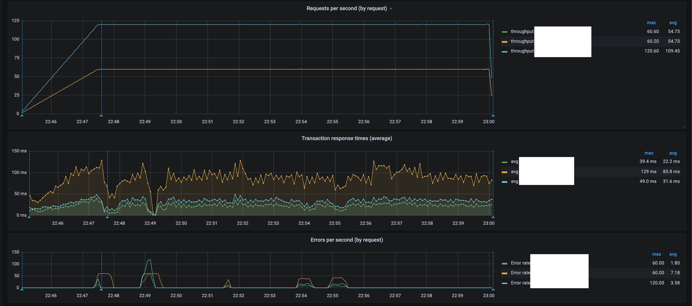
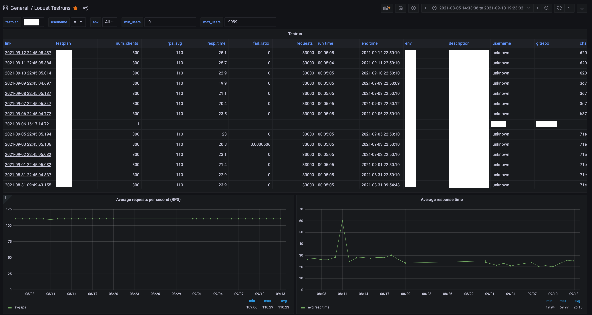
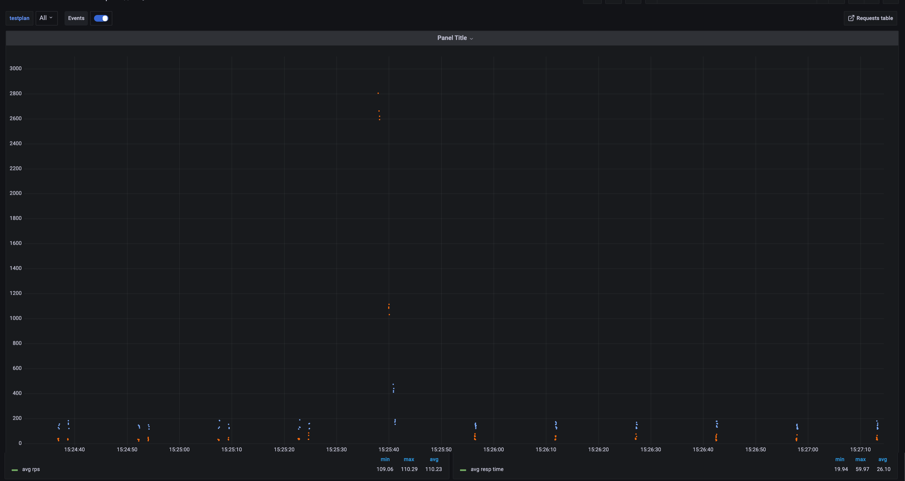

# Locust Dashboards

locust-plugins enables you to log Locust's results to a Postgres/Timescale database and to analyze them using Grafana in real time, or after the test has completed. 

The dashboards provide a good overview as well as the ability to drill down, as each request is logged individually. It also logs important run events (number of active users, ramp up finished etc) as well as aggregated results after the test has finished. Because the data is persisted, you can also track any changes in the performance of your system over time.

This aims to be a complete replacement for the reporting/graphing parts of the Locust web UI, so it is often used with Locust in [--headless](https://docs.locust.io/en/stable/running-without-web-ui.html#running-without-the-web-ui) mode.

Because Timescale is queried using regular SQL it is relatively straightforward make your own custom dashboards or edit the existing ones. You can even calculate your own completely custom metrics (e.g. number of requests above a certain response time threshold).

## `Locust` is the main dashboard, used for analyzing a whole test run


You can easily zoom in to a particular time interval, using the normal Grafana controls. Scroll down to view graphs split by request name:



## `Locust Requests Table` is used for detailed analysis of individual requests


You can customize/expand this table to fit your needs, especially if you want to track [context variables](https://docs.locust.io/en/stable/extending-locust.html#request-context) that are specific for your requests/system. The ones included in the table (ssn, request_id, etc) can be seen as an example.

## `Locust Testruns` is used to locate old test runs and graph performance changes between runs.



Click the link in the leftmost column to view the main dashboard for that particular run. You can filter your runs based on things like locustfile name, user count, and test environment environment. Your graphs can end up looking strange until you do this (as they will contain all your test runs, regardless of target system, user count, etc).

## `Locust scatter plot` is used to visualize the response times of individual requests



This is useful to know if your requests are being sent unevenly (like in this example) or if response times are very uneven (to tell the difference between, for example, most requests being fast, but a few being *very slow* and all requests being a *little* slow - something that might otherwise be hidden in a regular graph showing only averages)

# Setup

In order to log Locust's requests and run data into Timescale you simply:

* `import locust_plugins` in your locustfile (or any of locust_plugins underlying modules)
* add `--timescale` to the command line. 

But if you dont already have a Timescale database lying around (most people dont), you need to set it up first.

## docker-compose-based Timescale + Grafana

Assuming you have docker installed you can just run `locust-compose up`. It will give you a Timescale & Grafana container. 

```
~ locust-compose up
+ docker compose -f /usr/local/lib/python3.9/site-packages/locust_plugins/timescale/docker-compose.yml up
[+] Running 6/6
 ⠿ Network timescale_timenet            Created
 ⠿ Volume "timescale_grafana_data"      Created
 ⠿ Volume "timescale_postgres_data"     Created
 ⠿ Container timescale_grafana_1        Started
 ⠿ Container timescale_postgres_1       Started
 ⠿ Container timescale_setup_grafana_1  Started
Attaching to grafana_1, postgres_1, setup_grafana_1
...
---------------------------------------------------------------------------------------------------------------------------------
setup_grafana_1  | You can now connect to Grafana, the main dashboard is at http://localhost:3000/d/qjIIww4Zz?from=now-15m&to=now
---------------------------------------------------------------------------------------------------------------------------------
```

Follow the link and you will find your fresh (empty) main Locust dashboard.

You can now run a locust test like this:

```
~ locust --timescale --headless -f locustfile_that_imports_locust_plugins.py
[2021-12-06 14:44:18,415] myhost/INFO/root: Follow test run here: http://localhost:3000/d/qjIIww4Zz?var-testplan=locustfile.py&from=1638798258415&to=now
...
KeyboardInterrupt
2021-12-06T13:49:03Z
[2021-12-06 14:49:03,444] myhost/INFO/locust.main: Running teardowns...
[2021-12-06 14:49:03,521] myhost/INFO/root: Report: http://localhost:3000/d/qjIIww4Zz?&var-testplan=locust/demo.py&from=1638798536901&to=1638798544471
```

If you hadn't already guessed it from the output, `locust-compose` is just a thin wrapper around `docker-compose`. When you are finished testing, just press CTRL-C or run `locust-compose down`

Both timescale data and any grafana dashboard edits are persisted as docker volumes even if you shut it down. To remove the data volumes run `locust-compose down -v`.

For security reasons, the ports for logging to Timescale and accessing Grafana only accessible on localhost. If you want them to be reachable from the outside (e.g. to run a distributed test with workers running on a different machine), copy the docker-compose.yml file and change it as needed.

## Manual setup

1. Set up a Postgres instance, install Timescale (or use the ready-made one from Docker Hub: cyberw/locust-timescale:latest)
2. Set/export Postgres environment variables to point to your instance (PGHOST, PGPORT, PGUSER, PGPASSWORD)
3. If you didnt use the pre-built docker image, set up the tables by running something like `psql < timescale_schema.sql` (https://github.com/SvenskaSpel/locust-plugins/blob/master/locust_plugins/timescale/locust-timescale/timescale_schema.sql)
4. Set up Grafana. Edit the variables in [grafana_setup.sh](locust-timescale/grafana_setup.sh) and run it to set up a datasource pointing to your Timescale and import the Locust dashboards from grafana.com (or you can do it manually from [here](https://grafana.com/grafana/dashboards/10878)).

# Limitations

* Because each request is logged, it adds some CPU overhead to Locust workers (but the DB writes are batched & async so the impact should be minor)
* Timescale is very efficient at writing data, but if you are running big tests you might overload it (which would cause Locust to stop writing to the database and probably throwing lots of errors). We have succesfully run >5000 req/s tests writing to a very modest Timescale server with no issues.
* Analyzing long high-throughput tests is slow (because Grafana will be querying Timescale for huge amounts of data). Zoom in to a smaller time interval or use the aggregated data instead.
* See [listeners.py](../listeners.py) for the implementation