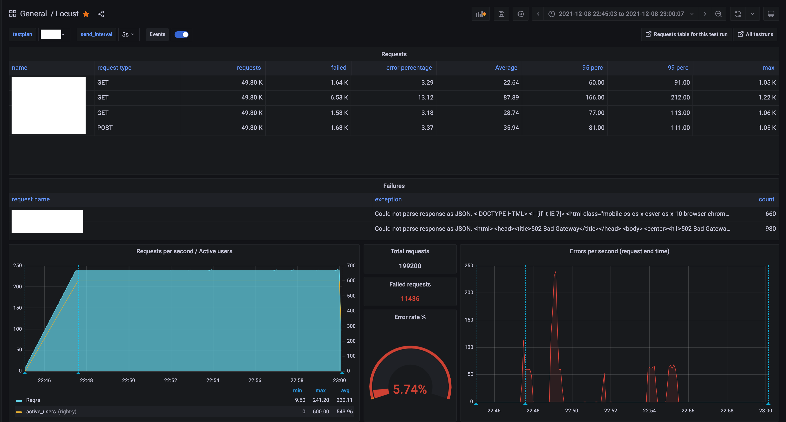
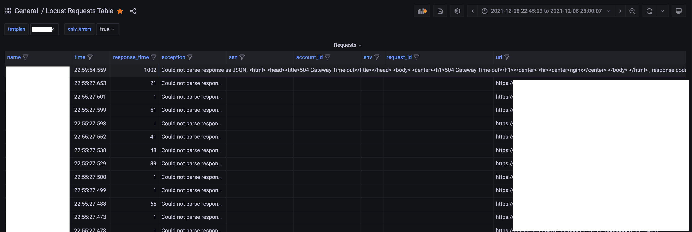

# Locust Dashboards

locust-plugins enables you to log requests & events to a Postgres/Timescale database.

This data can then be monitored and analyzed in Grafana in real time, or after the test has completed. The dashboards also make it easy to find old test runs and compare results over time. It aims to be a more or less complete replacement for the reporting/graphing parts of the Locust web UI (but it is possible to use both at the same time).

## The first dashboard is used for analyzing an individual test run:



It also provides graphs for individual requests (by name)


## The second one is used for detailed analysis of individual requests



You can customize/expand this table to fit your needs, especially if you want to track [context variables](https://docs.locust.io/en/stable/extending-locust.html#request-context) that are specific for your requests/system. The ones included in the table (ssn, request_id, etc) can be seen as an example.


## The third dashboard is used to locate old test runs and follow performance changes over time. 


Use the settings at the top of the page to filter out only tests against the same system, with the same user count, on the same environment, etc, to make sure your graphs are relevant.

# Setup

In order to log Locust's requests and run data into Timescale you add `--timescale` to the command line. But first you need to set up Timescale:

## docker-compose-based Timescale + Grafana

Assuming you have docker installed you can just run `locust-compose up`. It will give you a timescale witht the 

```
~ locust-compose up
+ docker compose -f /usr/local/lib/python3.9/site-packages/locust_plugins/timescale/docker-compose.yml up
[+] Running 6/6
 ⠿ Network timescale_timenet            Created
 ⠿ Volume "timescale_grafana_data"      Created
 ⠿ Volume "timescale_postgres_data"     Created
 ⠿ Container timescale_grafana_1        Started
 ⠿ Container timescale_postgres_1       Started
 ⠿ Container timescale_setup_grafana_1  Started
Attaching to grafana_1, postgres_1, setup_grafana_1
...
---------------------------------------------------------------------------------------------------------------------------------
setup_grafana_1  | You can now connect to Grafana, the main dashboard is at http://localhost:3000/d/qjIIww4Zz?from=now-15m&to=now
---------------------------------------------------------------------------------------------------------------------------------
```

Follow the link and you will find your fresh (empty) main Locust dashboard, used for analyzing test runs.

You can now run a locust test like this:

```
~ locust --timescale --headless -f locustfile_that_imports_locust_plugins.py
[2021-12-06 14:44:18,415] myhost/INFO/root: Follow test run here: http://localhost:3000/d/qjIIww4Zz?var-testplan=locustfile.py&from=1638798258415&to=now
...
KeyboardInterrupt
2021-12-06T13:49:03Z
[2021-12-06 14:49:03,444] myhost/INFO/locust.main: Running teardowns...
[2021-12-06 14:49:03,521] myhost/INFO/root: Report: http://localhost:3000/d/qjIIww4Zz?&var-testplan=locust/demo.py&from=1638798536901&to=1638798544471
```

If you hadn't already guessed it from the output, `locust-compose` is just a thin wrapper around `docker-compose`. When you are finished testing, just press CTRL-C or run `locust-compose down`

Both timescale data and any grafana dashboard edits are persisted as docker volumes even if you shut it down. To remove the data volumes run `locust-compose down -v`.

For security reasons, the ports for logging to Timescale and accessing Grafana only accessible on localhost. If you want them to be reachable from the outside (e.g. to run a distributed test with workers running on a different machine), edit the docker-compose.yml file.

## Manual setup

1. Set up a Postgres instance, install Timescale (or use the one in docker-compose.yml, cyberw/locust-timescale:latest)
2. Set/export Postgres environment variables to point to your instance (PGHOST, PGPORT, PGUSER, PGPASSWORD)
3. If you didnt use the pre-built docker image, set up the tables by running something like `psql < timescale_schema.sql` (https://github.com/SvenskaSpel/locust-plugins/blob/master/locust_plugins/timescale/locust-timescale/timescale_schema.sql)
4. Set up Grafana. Edit the variables in [grafana_setup.sh](locust-timescale/grafana_setup.sh) and use it to set up a datasource pointing to your Timescale and import the Locust dashboards from grafana.com. If you prefer, you can do it manually from here: https://grafana.com/grafana/dashboards/10878

# Limitations

* Because each request is logged, it adds some CPU overhead to Locust workers (but the DB writes are batched & async so the impact should be minor)
* Timescale is really fast, but if you are running big tests you might overload timescale (which would cause Locust to stop writing to the database and throwing lots of errors). We have succesfully run >5000 req/s tests writing to a very modest Timescale server with no issues.
* Analyzing long high-throughput tests is slow (because Grafana will be querying Timescale for huge amounts of data). Zoom in to a smaller time interval or use the aggregated data instead.
* See [listeners.py](../listeners.py) for details